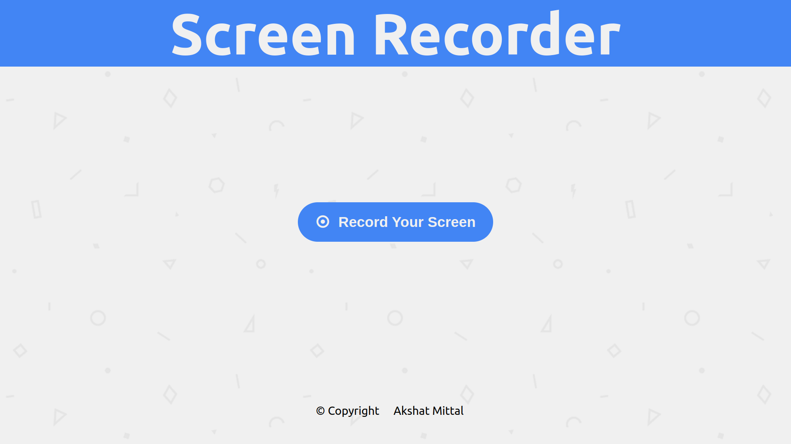
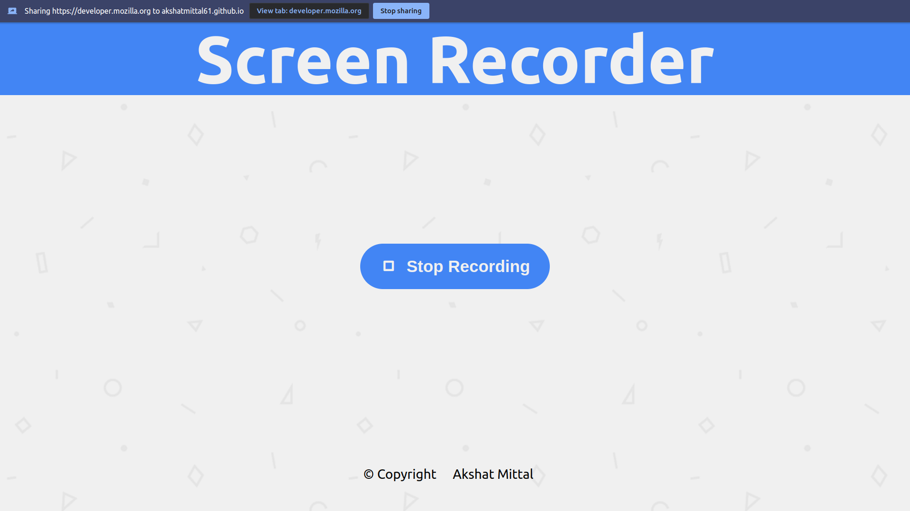
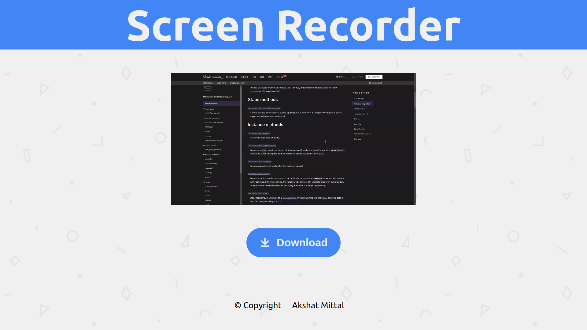

# Screen Recorder

## Description

This is a simple screen recorder made with a native Media Recorder element in JavaScript.

## How to use

1. Clone this repository
2. Open the `index.html` file in your browser
3. Click on the `Start Recording` button
4. Click on the `Stop Recording` button to stop recording
5. Click on the `Download Recording` button to download the recording

## Author

[Akshat Mittal](https://akshatmittal61.vercel.app/)

## License

[MIT](LICENSE)

## Screenshots

## Demo

[Click here](https://akshatmittal61.github.io/screen-recorder/)

## Support

If you like this repository, consider supporting me through GitHub Sponsors.
